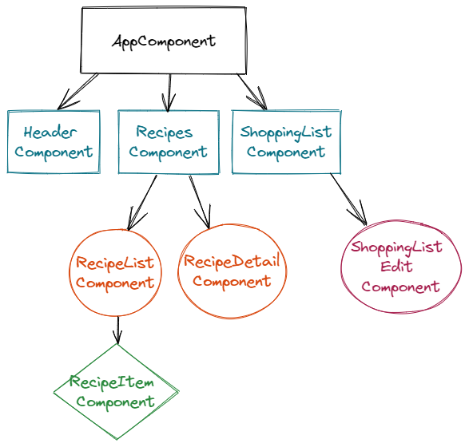

# Recipe App

- Firstly, let me create Components. Here is the component diagram. We will create components according to this hierarchical diagram.




- Then I implemented Header Component. I used Bootstrap in styling.

```tsx
<nav class="navbar navbar-default">
  <div class="container-fluid">
    <div class="navbar-header">
      <a href="#" class="navbar-brand">
        Recipe Book
      </a>
    </div>
    <div class="collapse navbar-collapse">
      <ul class="nav navbar-nav">
        <li>
          <a href="#">Recipes</a>
        </li>
        <li>
          <a href="#">Shopping List</a>
        </li>
      </ul>
      <ul class="nav navbar-nav navbar-right">
        <li class="dropdown">
          <a href="#" class="dropdown-toggle" role="button">
            Manage <span class="caret"></span>
          </a>
          <ul class="dropdown-menu">
            <li>
              <a href="#">Save Data</a>
            </li>
            <li>
              <a href="#">Fetch Data</a>
            </li>
          </ul>
        </li>
      </ul>
    </div>
  </div>
</nav>
```

I will add saving and fetching the operations in the “_dropdown-menu_” class later.

- Now, we will implement Recipes Component. Firstly, I add an empty array named recipes. This array contains the recipe. So, what does the recipe look like? We will create a model for determining the recipe.

```tsx
export class Recipe {
  public name: string;
  public description: string;
  public imgPath: string;

  constructor(name: string, desc: string, imgPath: string) {
    this.name = name;
    this.description = desc;
    this.imgPath = imgPath;
  }
}
```

- After creating the recipe model we will add some content to Recipes Component.

```tsx
recipes: Recipe[] = [
    new Recipe(
      'Meat',
      'Well cooked',
      'https://cdn.pixabay.com/photo/2017/07/16/10/43/recipe-2508859_960_720.jpg'
    ),
  ];
```

I added Recipe type to the recipes array and I gave a value in it.

- Then I implemented “recipe-list.component.html”

```tsx
<div class="row">
  <div class="col-xs-12">
    <div class="btn btn-success">New Recipe</div>
  </div>
</div>
<div class="row">
  <div class="col-xs-12">
    <a href="#" class="list-group-item clearfix" *ngFor="let recipe of recipes">
      <div class="pull-left">
        <h4 class="list-group-item-heading">{{ recipe.name }}</h4>
        <p class="list-group-item-text">{{ recipe.description }}</p>
      </div>
      <span class="pull-right">
        
      </span>
    </a>
    <app-recipe-item></app-recipe-item>
  </div>
</div>
```

We created a new “a” since every recipe object that created in recipe.list.ts file with `*ngFor()` method.

- Now we will implement _RecipeDetailComponent._

```tsx
<div class="row">
  <div class="col-xs-12">
    
  </div>
</div>

<div class="row">
  <div class="col-xs-12">
    <h1>Recipe Name</h1>
  </div>
</div>

<div class="row">
  <div class="col-xs-12">
    <div class="btn-group">
      <button type="button" class="btn btn-primary dropdown-toggle">
        Manage Recipe <span class="caret"></span>
      </button>
      <ul class="dropdown-menu">
        <li><a href="#">To Shopping</a></li>
        <li><a href="#">Edit Recipe</a></li>
        <li><a href="#">Delete Recipe</a></li>
      </ul>
    </div>
  </div>
</div>

<div class="row">
  <div class="col-xs-12">Description</div>
</div>
```

**ShoppingListComponent:**

```tsx
<div class="row">
  <div class="col-xs-10">
    <app-shopping-edit></app-shopping-edit>
  </div>
  <hr />
  <ul class="list-group">
    <a
      class="list-group-item"
      style="cursor: pointer"
      *ngFor="let ingredient of ingredients"
    >
      {{ ingredient.name }} {{ ingredient.amount }}g
    </a>
  </ul>
</div>
```

After implementation of the shopping list component, we add an empty array named ingredients in _shopping-list.component.ts_. And then we create a model for the ingredients array.

```tsx
export class Ingredient {
  constructor(public name: string, public amount: number) {}
}
```

- Finally, I implemented ShoppingEditComponent.

```tsx
<div class="row">
  <div class="col-xs-12">
    <form>
      <div class="row">
        <div class="col-sm-5 form-group">
          <label for="name">Name</label>
          <input type="text" id="name" class="form-control" />
        </div>
        <div class="col-sm-2 form-group">
          <label for="amount">Amount</label>
          <input type="number" id="amount" class="form-control" />
        </div>
      </div>
      <div class="row">
        <div class="col-xs-12">
          <button
            class="btn btn-success"
            type="submit"
            style="margin-right: 12px"
          >
            Add
          </button>
          <button
            class="btn btn-danger"
            type="button"
            style="margin-right: 12px"
          >
            Delete
          </button>
          <button
            class="btn btn-primary"
            type="button"
            style="margin-right: 12px"
          >
            Clear
          </button>
        </div>
      </div>
    </form>
  </div>
</div>
```

It was a very basic project to understand Angular basics.
